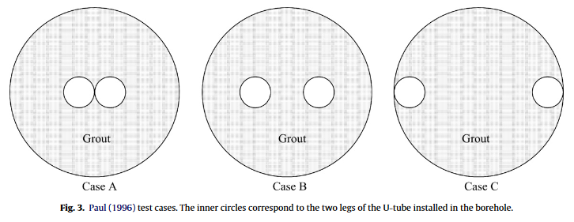
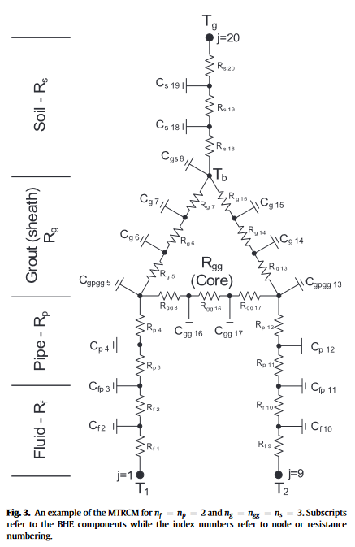
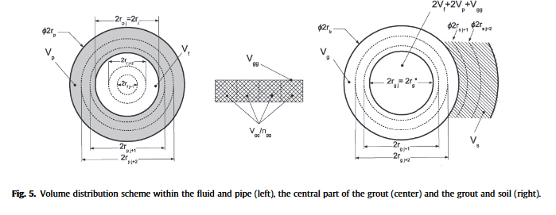
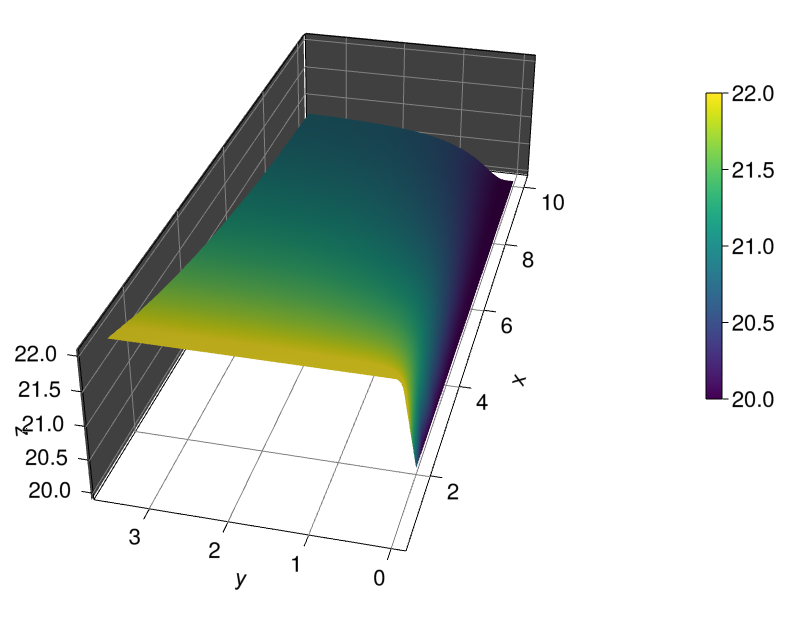
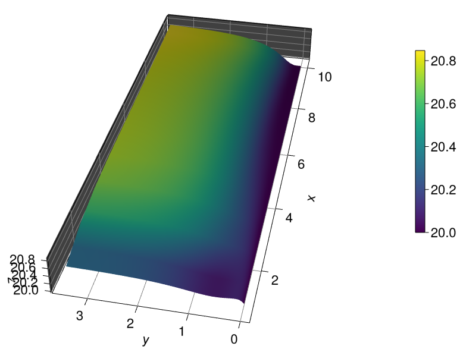
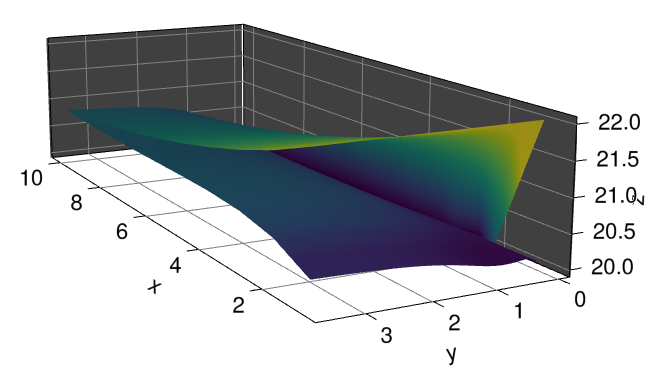

# Borehole_modelisation
Project dedicated to borehole modilisation and command using Julia 
---

## _Understand the model_ 

The model is a Acausal component based model containing : 
- The discrete convection-diffusion component giving a temperature discretisation through time and space : u(t)[x]
- The layer instantiation, function of n size of u(t)[x]
- Ploting of the solution

Note :
We are modelizing a U-Tube case-B Borehole

## _How to understand the code_ 

1 - Today, the working codes are called "BHE_3D_CODE" and "Wall_layer_work.jl", they contain the layer-discretisation model solving and plotting. And maybe some of the variables are "undefined" like _timer_ (or others) but you can just add a definition before instantiation of the model "soil_..._layer". The compilation is quite long for the first run. "BHE_3D_CODE" contain the computation with the variables layers of MRCTM. 

2 - You can have acces to the "include files" which contain _data's computation_ and the _components_ declaration. The "function_component.jl" contain the main features, the component declaration. So the focus have to be done on that. note : it uses the "wall_component" which is a serie of R-C-R-C-R (like a wall) and a component soil_temp which is a constant-voltage (temperature). 

3 - The component called "soil_MTRCM_var_pin_var_ver_2" contain the most updated work. So the focus have to be done on that. note : it uses the "soil_MRCTM" which is layers of MRCTM model, a component soil_temp which is a constant-voltage (temperature) and of course 2 fluid discretisation computation (with two different velocity sign).

4 - The model also include now computation for the heat exchange with the ambient air/first layer of soil and for the Heat exchange between all layers.

# Result and Display 
## Display of the soil-capacitor through time/depth/radius (radius of soil in a horizontal point of view, see fig 5, there is a capacitor for each soil) 
### Conditions  
- 10 meters of soil - 10 layers for MRCTM model
- Initial Temperature at 20 Degrees for the whole model
- 41 days of simulation
- velocity of the internal fluid of 0,0001 m/s 
- boundaries condition on the fluid-discretization = [T_1(t, 0.0) ~ T_soil+2, T_1(0.0, x) ~ T_soil, T_2(0.0, x) ~ T_soil, T_1(t, xmax) ~ T_2(t, 0.0)]

### Explanation 
The soil is being heat by the fluid inside the borehole which is for instance at 22 Degrees. You can see that the heat propagate throught time inside the soil layers "Discrete radius". We can also see that the more we go deep inside the soil (discrete depth), the less heat is propagating. 

## Display of the fluid going down in the borehole
### Conditions 
- 10 meters of soil - 10 layers for MRCTM model
- Initial Temperature at 20 Degrees for the whole model
- 41 days of simulation
- velocity of the internal fluid of 0,000001 m/s 
- boundaries condition on the fluid-discretization = [T_1(t, 0.0) ~ T_soil+2, T_1(0.0, x) ~ T_soil, T_2(0.0, x) ~ T_soil, T_1(t, xmax) ~ T_2(t, 0.0)]

### Explanation 
The Y axis is the time axis. At time 0 everything is at 20 Degrees C. Then the fluid at layer 0 (top of the borehole) is being heat at 22 every time. This heat propagate inside the fluid in depth. 

## Display of the fluid going up (because it's a "U" borehole model) in the borehole 
### Conditions 
Same as before.

### Explanation 
The Y axis is the time axis. This fluid 2 is connected at layer 10 with the precedent fluid. The heat at the end of time and at the layer 0 is around 20.3 Degrees C. 

## Display of the fluid going down and up inside the "U" borehole
### Conditions 
Same as before. 

# References and libraries 
[1]
Short-term simulation of ground heat exchanger with an improved TRCM
Philippe Pasquier*, Denis Marcotte
Department of Civil, Geological and Mining Engineering, École Polytechnique de Montréal, C.P. 6079 Succ. Centre-Ville, Montréal, Québec, Canada H3C 3A7

[2]
A review of methods to evaluate borehole thermal resistances in geothermal
heat-pump systems
Louis Lamarche ∗, Stanislaw Kajl, Benoit Beauchamp
École de Technologie Supérieure, 1100 Notre-Dame Ouest, Montréal, Canada H3C 1K3

[deps]
CairoMakie = "13f3f980-e62b-5c42-98c6-ff1f3baf88f0"
ColorSchemes = "35d6a980-a343-548e-a6ea-1d62b119f2f4"
CompositeTypes = "b152e2b5-7a66-4b01-a709-34e65c35f657"
DataDrivenDMD = "3c9adf31-5280-42ff-b439-b71cc6b07807"
DataDrivenDiffEq = "2445eb08-9709-466a-b3fc-47e12bd697a2"
DifferentialEquations = "0c46a032-eb83-5123-abaf-570d42b7fbaa"
DomainSets = "5b8099bc-c8ec-5219-889f-1d9e522a28bf"
GLMakie = "e9467ef8-e4e7-5192-8a1a-b1aee30e663a"
IfElse = "615f187c-cbe4-4ef1-ba3b-2fcf58d6d173"
LinearAlgebra = "37e2e46d-f89d-539d-b4ee-838fcccc9c8e"
Makie = "ee78f7c6-11fb-53f2-987a-cfe4a2b5a57a"
MethodOfLines = "94925ecb-adb7-4558-8ed8-f975c56a0bf4"
ModelingToolkit = "961ee093-0014-501f-94e3-6117800e7a78"
ModelingToolkitDesigner = "23d639d0-9462-4d1e-84fe-d700424865b8"
OrdinaryDiffEq = "1dea7af3-3e70-54e6-95c3-0bf5283fa5ed"
Plots = "91a5bcdd-55d7-5caf-9e0b-520d859cae80"
Setfield = "efcf1570-3423-57d1-acb7-fd33fddbac46"
SpecialFunctions = "276daf66-3868-5448-9aa4-cd146d93841b"
StaticArrays = "90137ffa-7385-5640-81b9-e52037218182"
WGLMakie = "276b4fcb-3e11-5398-bf8b-a0c2d153d008"

